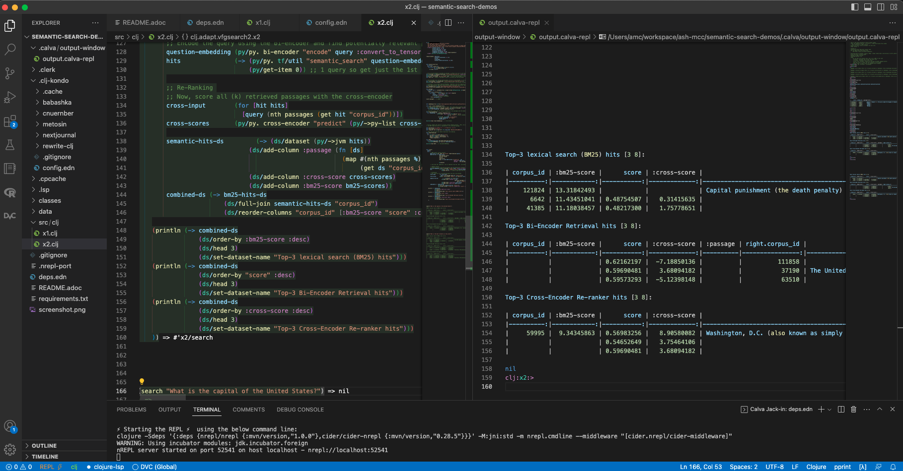

# Demos of 'semantic' search

Demos of searching based on: embedding into a learnt 'semantic' model, the texts to be searched over.

== Run

(After installing the Python modules - see `requirements.txt`) 
run the froms in `x1.clj` or `x2.clj` in a Clojure REPL.

//
// USING PYTHON
//
// the process on my machine, logs the following Python related info:
//
// [main] I libpython-clj2.python.info - Detecting startup info
// [main] I libpython-clj2.python - Startup info {:lib-version "3.8", :java-library-path-addendum "/Library/Developer/CommandLineTools/Library/Frameworks/Python3.framework/Versions/3.8/lib", :exec-prefix "/Library/Developer/CommandLineTools/Library/Frameworks/Python3.framework/Versions/3.8", :executable "/Library/Developer/CommandLineTools/usr/bin/python3", :libnames ("python3.8m" "python3.8"), :prefix "/Library/Developer/CommandLineTools/Library/Frameworks/Python3.framework/Versions/3.8", :base-prefix "/Library/Developer/CommandLineTools/Library/Frameworks/Python3.framework/Versions/3.8", :libname "python3.8m", :base-exec-prefix "/Library/Developer/CommandLineTools/Library/Frameworks/Python3.framework/Versions/3.8", :python-home "/Library/Developer/CommandLineTools/Library/Frameworks/Python3.framework/Versions/3.8", :version [3 8 9], :platform "darwin"}
// [main] I libpython-clj2.python - Prefixing java library path: /Library/Developer/CommandLineTools/Library/Frameworks/Python3.framework/Versions/3.8/lib
// [main] I libpython-clj2.python - Loading python library: /Library/Developer/CommandLineTools/Library/Frameworks/Python3.framework/Versions/3.8/lib/libpython3.8.dylib
// [tech.resource.gc ref thread] I tech.v3.resource.gc - Reference thread starting
// [main] I tech.v3.datatype.nio-buffer - Unable to find direct buffer constructor - falling back to jdk16 memory model.
//
//
// $ /Library/Developer/CommandLineTools/usr/bin/python3 -VV
// Python 3.8.9 (default, Apr 13 2022, 08:48:06)
// [Clang 13.1.6 (clang-1316.0.21.2.5)]
//
// $ python3 -VV
// Python 3.8.9 (default, Apr 13 2022, 08:48:06)
// [Clang 13.1.6 (clang-1316.0.21.2.5)]
//
//
// $ python3 -m pipreqs.pipreqs  # ineffective if the libs can't be found by a static analysis of .py files
// $ python3 -m pip install -r requirements.txt
//